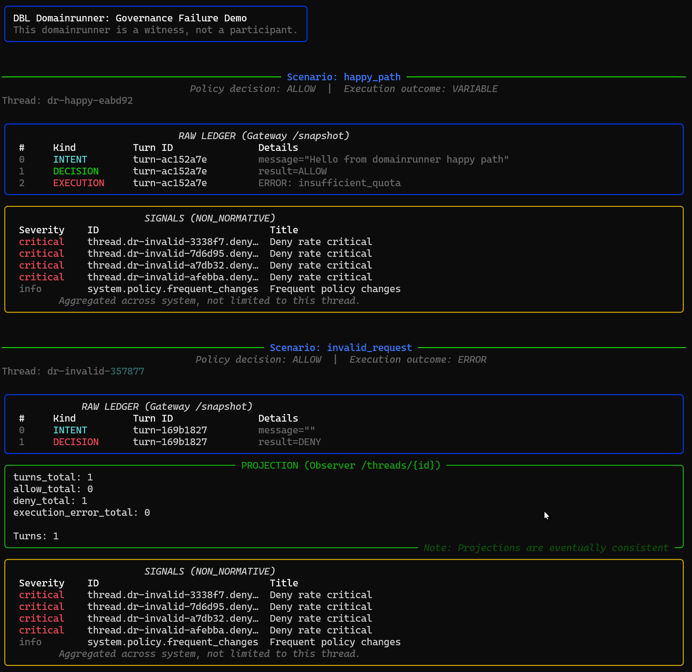

# dbl-domainrunner-governance-failure

**This Domainrunner is a witness, not a participant.**

It does not decide.
It does not correct.
It does not infer.

It shows what happened.

---

## Purpose

This repository demonstrates, in a reproducible and concrete way, why AI governance fails even with good data when no deterministic boundary exists — and how DBL makes those failures **explicit, attributable, and auditable**.

This is not a framework.
This is not an agent.
This is a demonstration artifact.

---

## What This Demo Proves

Most AI systems collapse three concerns into one opaque flow:
1. **Decision**
2. **Execution**
3. **Interpretation**

This demo shows them separated and visible.



### What You Are Looking At

The screenshot above shows three layers at once:

**1. RAW LEDGER (Panel A)**
Exact events as recorded by the Gateway.
(INTENT → DECISION → EXECUTION)

**2. PROJECTION (Panel B)**
Aggregated, non-authoritative view from the Observer.
(Eventually consistent by design)

**3. SIGNALS (Panel C)**
NON_NORMATIVE attention markers across the system.
They do not affect decisions.

**Nothing in this view is reconstructed.**
**Nothing is inferred.**
**Everything shown existed as an event.**

---

## Scenarios

| Scenario | Outcome | What becomes explicit |
|----------|---------|-----------------------|
| `happy_path` | DECISION = ALLOW, EXECUTION = OK or ERROR | Governance correctness is independent of execution success |
| `invalid_request` | DECISION = ALLOW, EXECUTION = ERROR (400) | Failure is classified, not guessed |
| `policy_deny` | DECISION = DENY, no execution | Policy refusal is explicit and auditable (Phase 2) |

---

## Architecture (Read This First)

```
┌────────────────────────────────────────────────────────────────┐
│                      DOMAINRUNNER                              │
│                                                                │
│  • Sends INTENTs to Gateway                                    │
│  • Reads raw ledger from Gateway (/snapshot)                   │
│  • Reads projections from Observer (/threads, /signals)        │
│                                                                │
│  • DOES NOT make decisions                                     │
│  • DOES NOT interpret outcomes                                 │
│  • DOES NOT store authoritative state                          │
│  • DOES NOT write to Observer                                  │
└────────────────────────────────────────────────────────────────┘
         │                                    │
         │ POST /ingress/intent               │ GET /threads, /signals
         │ GET /snapshot                      │ (read-only)
         ▼                                    ▼
┌─────────────────────┐              ┌─────────────────────┐
│    DBL-GATEWAY      │              │    DBL-OBSERVER     │
│   (NORMATIVE)       │              │   (NON_NORMATIVE)   │
│                     │              │                     │
│ • Emits DECISION    │              │ • Projects state    │
│ • Executes (or not) │              │ • Aggregates events │
│ • Appends ledger    │              │ • Emits signals     │
└─────────────────────┘              └─────────────────────┘
```

### Communication Rules (HARD)

| From | To | Method | Allowed |
|------|----|--------|---------|
| Domainrunner | Gateway | `/ingress/intent` | ✅ |
| Domainrunner | Gateway | `/snapshot` | ✅ |
| Domainrunner | Observer | `/threads`, `/signals` | ✅ |
| **Domainrunner** | **Observer** | **`/ingest`** | ❌ **FORBIDDEN** |

If the domainrunner ever writes to the Observer, the demo is invalid.

---

## Quick Start (≈ 60 seconds)

### Prerequisites

- **DBL Gateway** running on `http://127.0.0.1:8010`
- **DBL Observer** running on `http://127.0.0.1:8020` (optional but recommended)

### Run

1. **Start Bridge** (Gateway → Observer sync)
   ```powershell
   python -m domainrunner.bridge
   ```

2. **Run Scenarios**
   ```powershell
   python -m domainrunner
   ```

The domainrunner will:
- Submit INTENTs
- Wait for outcomes
- Fetch ledger and projections
- Render results to the terminal

---

## Why This Matters

Without deterministic boundaries, systems report outcomes like:
- "the AI failed"
- "the AI refused"
- "the AI worked"

These statements are meaningless.

With DBL, the same situations become:

| Situation | What DBL shows |
|-----------|----------------|
| Quota exceeded | **DECISION: ALLOW**, **EXECUTION: ERROR** (insufficient_quota) |
| Invalid request | **DECISION: ALLOW**, **EXECUTION: ERROR** (invalid_request) |
| Policy violation | **DECISION: DENY**, reason recorded |
| Success | **DECISION: ALLOW**, **EXECUTION: OK** |

This is not better logging.
This is responsibility separation.

---

## Constraints (NON-NEGOTIABLE)

1. **No policy logic inside the domainrunner**
2. **No decision inference**
3. **No authoritative state**
4. **No writes to Observer**

Violation of any of these invalidates the demo.

---

## Phases

| Phase | Scenarios | Status |
|-------|-----------|--------|
| **1** | `happy_path`, `invalid_request` | ✅ Ready |
| **2** | `policy_deny` | Requires policy pack |

---

## Final Note

This repository does not try to fix failures.
It makes failures legible.

**That is the point.**